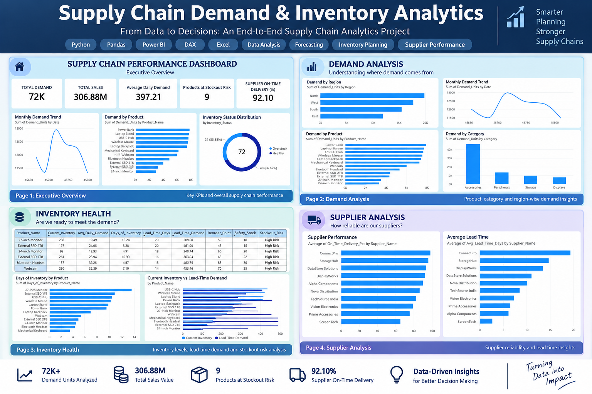

# 📦 Supply Chain Demand & Inventory Analytics

### End-to-End Supply Chain Analytics using Python, Pandas, Power BI & DAX



> An end-to-end supply chain analytics project that transforms demand, inventory, and supplier data into actionable insights for better planning and decision-making.

---

## 📌 Project Overview

Effective supply chain planning requires organizations to balance customer demand, inventory availability, supplier reliability, and replenishment requirements.

This project analyzes a synthetic supply chain dataset to understand:

- Demand patterns across products, categories, and regions
- Inventory availability and coverage
- Products exposed to stockout risk
- Lead-time demand and replenishment requirements
- Supplier delivery performance
- Supplier lead times
- Short-term demand forecasting and forecast accuracy

The project combines **Python-based data analysis** with an interactive **Power BI dashboard** to demonstrate how raw operational data can be transformed into business insights.

---

## 🎯 Business Objectives

The analysis focuses on the following business questions:

1. Which products generate the highest demand?
2. Which categories contribute the most to demand?
3. Which regions drive the highest demand?
4. How much inventory is currently available?
5. Which products are at risk of stockout?
6. How many days of demand can current inventory support?
7. What is the expected demand during supplier lead time?
8. Which suppliers have stronger on-time delivery performance?
9. Which suppliers have longer lead times?
10. Can historical demand patterns be used to generate short-term forecasts?
11. How accurate is the forecasting approach?

---

# 🛠️ Tech Stack

| Technology | Purpose |
|---|---|
| 🐍 **Python** | Data preprocessing, analysis and forecasting |
| 🐼 **Pandas** | Data cleaning, transformation and aggregation |
| 🔢 **NumPy** | Numerical and inventory-risk calculations |
| 📊 **Matplotlib** | Exploratory data visualization |
| 📈 **Power BI** | Interactive dashboard and business reporting |
| 🧮 **DAX** | KPI and analytical measure development |
| 📗 **Excel** | Dataset and structured data source |

---

# 🔄 Project Workflow

```text
                    Raw Supply Chain Data
                             │
                             ▼
                  Data Cleaning & Validation
                             │
                             ▼
                 Exploratory Data Analysis
                             │
              ┌──────────────┼──────────────┐
              ▼              ▼              ▼
        Demand Analysis  Inventory      Supplier
                         Analysis        Analysis
              │              │              │
              └──────────────┼──────────────┘
                             ▼
                    Demand Forecasting
                             │
                             ▼
                    Power BI Dashboard
                             │
                             ▼
                     Business Insights
